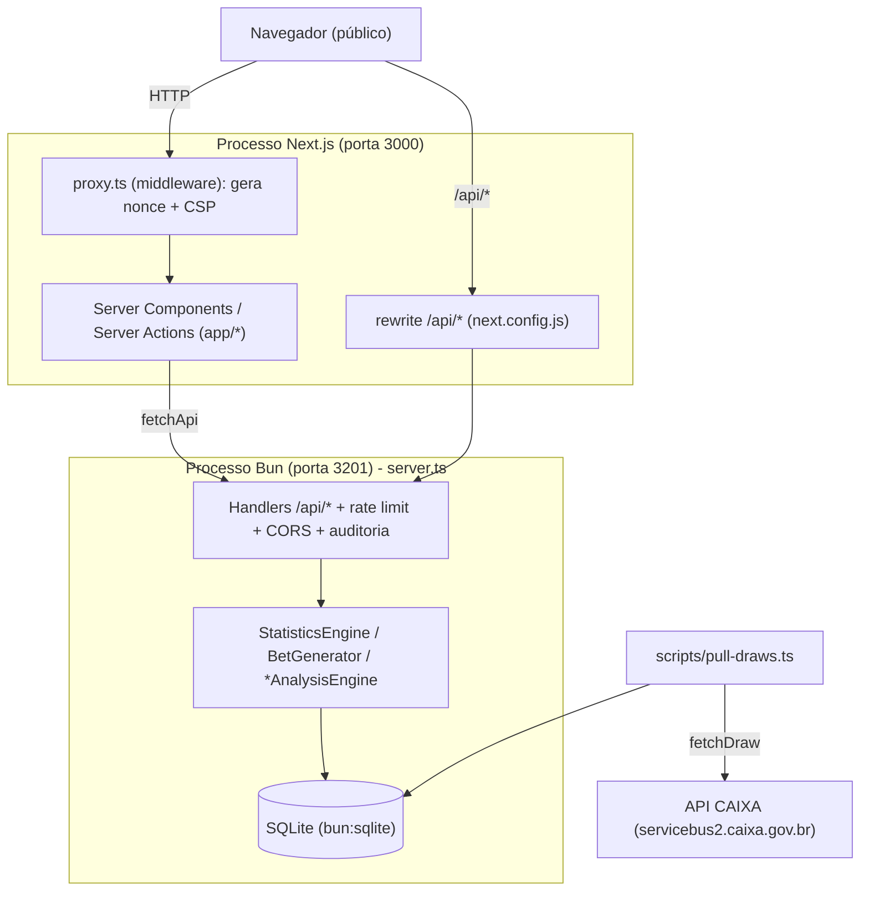
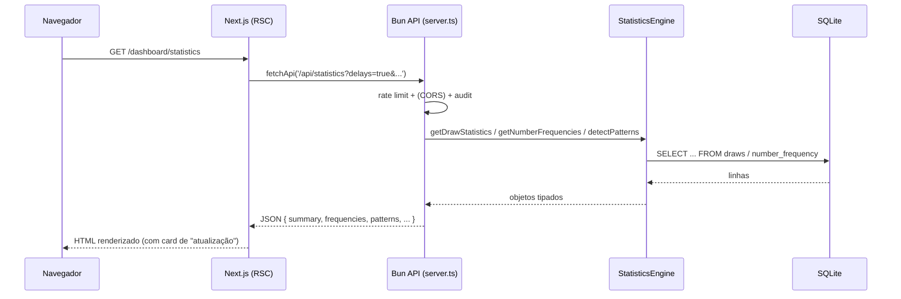

# 01 - Visão Geral do Sistema

## O que este capítulo ensina

O que o Mega-Sena Analyzer faz, para quem, e como suas peças de runtime se
encaixam — antes de qualquer detalhe de implementação.

## Por que isso importa

Se você não tem o mapa do "todo", cada arquivo parece desconexo. Aqui você ganha o
modelo mental que faz `server.ts`, `app/` e `lib/` fazerem sentido juntos.

## Modelo mental

Imagine uma biblioteca com dois funcionários:

- Um **arquivista** (o servidor Bun, `server.ts`) que cuida do acervo (banco SQLite),
  faz as contas estatísticas e responde perguntas em JSON.
- Um **recepcionista** (o servidor Next.js) que recebe o público, monta as páginas
  bonitas e, quando precisa de dados, pergunta ao arquivista.

O público (navegador) quase nunca fala direto com o arquivista; fala com o
recepcionista, que repassa os pedidos.

---

## Explicação detalhada

### O que o sistema faz (verificado no código)

1. **Baixa** sorteios históricos da API oficial da CAIXA — `lib/api/caixa-client.ts`
   (`CaixaAPIClient.fetchDraw`, `fetchAllDraws`), acionado por `scripts/pull-draws.ts`.
2. **Armazena** em SQLite local — `lib/db.ts` + `db/migrations/*.sql`.
3. **Analisa** padrões históricos — `lib/analytics/*` (frequência, atrasos, décadas,
   pares, paridade, primos, soma, streaks, correlação com prêmio).
4. **Gera** estratégias de aposta dentro de um orçamento — `lib/analytics/bet-generator.ts`.
5. **Expõe** tudo via API JSON — `server.ts` (rotas `/api/health`, `/api/dashboard`,
   `/api/statistics`, `/api/trends`, `/api/generate-bets`).
6. **Apresenta** em páginas web — `app/dashboard/*`.

Premissa explícita do produto (não é marketing, está no código e nas páginas):
**loteria não é previsível**. O sistema analisa o que **já aconteceu**; não promete
o futuro. Veja os textos de aviso em `app/page.tsx`, `app/about/page.tsx` e
`app/dashboard/generator/page.tsx`.

### Usuários

- **Apostadores curiosos** que querem ver frequências e tendências (Dashboard,
  Estatísticas).
- **Quem quer otimizar orçamento** de aposta (Gerador).
- **Operadores/desenvolvedores** que mantêm e implantam o sistema.

Não há login, conta ou dados de usuário cadastrados — não existe tabela de usuários
populada (a tabela `user_bets` existe no schema mas **não é usada** por nenhum código;
ver `04-data-flow.md`).

### Arquitetura de runtime: dois processos

O ponto mais importante e menos óbvio do projeto: **são dois servidores**.



- **Processo Next.js (3000):** renderiza HTML. O middleware `proxy.ts` injeta um
  *nonce* por requisição e os headers de segurança/CSP. `next.config.js` reescreve
  `/api/:path*` para o servidor Bun.
- **Processo Bun (3201):** `server.ts` usa `Bun.serve`. É o único que toca o banco
  (porque `bun:sqlite` só existe no Bun). Faz rate limiting, CORS, validação Zod,
  auditoria e logging.
- **Ingestão:** `scripts/pull-draws.ts` é um processo à parte, executado sob demanda,
  que popula o banco a partir da CAIXA.

Por que separar? Está comentado em `app/dashboard/generator/actions.ts`: Server
Actions do Next rodam em Node, mas o banco exige Bun. Então a lógica de dados vive no
processo Bun, e o Next a consome por HTTP.

### Fluxo de uma requisição típica (estatísticas)



### Componentes de runtime (resumo)

| Componente | Arquivo | Papel |
| --- | --- | --- |
| Servidor de API | `server.ts` | HTTP + segurança + orquestra engines |
| Camada de banco | `lib/db.ts` | abre SQLite, migrations, fallback em memória |
| Motor estatístico | `lib/analytics/statistics.ts` | frequências, padrões, resumo |
| Gerador de apostas | `lib/analytics/bet-generator.ts` | otimização de orçamento |
| Cliente CAIXA | `lib/api/caixa-client.ts` | baixa sorteios com retry/backoff |
| Middleware | `proxy.ts` | nonce + CSP + headers |
| Páginas | `app/dashboard/*` | UI (Server Components) |
| Cliente de fetch | `lib/api/api-fetch.ts` | RSC → API com timeout e segredo interno |

## Como verificar isso no código

```bash
# Os dois servidores e suas portas
grep -n "serve(" server.ts                 # Bun.serve
grep -n "API_PORT\|PORT" scripts/dev.ts     # 3201 (API) e 3000 (Next)
grep -n "rewrites\|API_HOST\|API_PORT" next.config.js

# A fronteira "RSC chama API", não o banco diretamente
grep -n "fetchApi" app/dashboard/page.tsx app/dashboard/statistics/page.tsx
grep -n "use server" app/dashboard/generator/actions.ts
```

## Mal-entendidos comuns

- **"O Next.js acessa o SQLite direto."** Não. Só o processo Bun (`server.ts`) toca o
  banco. O Next pede por HTTP via `fetchApi`.
- **"É um app só."** São dois processos cooperando; em dev, `scripts/dev.ts` sobe os
  dois; em produção, `scripts/start-prod.ts` (ou `start-docker.ts`).
- **"Existe banco de dados de usuários."** Não há autenticação; `user_bets` está no
  schema mas é tabela morta.
- **"O sistema prevê números."** Premissa oposta: ele só analisa histórico.

## Exercícios

1. **(Fácil)** Liste as 5 rotas `/api/*` lendo o objeto `apiHandlers` em `server.ts`.
   **Gabarito:** `/api/health`, `/api/dashboard`, `/api/statistics`, `/api/trends`,
   `/api/generate-bets`.
2. **(Médio)** Desenhe, sem olhar o diagrama acima, o caminho de um clique em "Gerar
   apostas" até o banco. Depois confira em `generator-form.tsx` →
   `actions.ts` → `server.ts` (`/api/generate-bets`) → `BetGenerator`.
3. **(Médio)** Em `scripts/dev.ts`, identifique por que o Next só sobe **depois** da
   API. **Gabarito:** `waitForApiHealth` espera `/api/health` responder antes de
   iniciar o Next, evitando 502 em rewrites no boot.

---

### Procedência das afirmações

- **Verificado no código:** dois processos e portas (`server.ts`, `scripts/dev.ts`,
  `next.config.js`); fronteira RSC→API (`fetchApi`, `actions.ts`); rotas (`apiHandlers`);
  ausência de uso de `user_bets`; textos de aviso nas páginas.
- **Inferido do código:** a motivação "Node vs Bun" para separar processos (apoiada
  pelo comentário em `actions.ts`).
- **Conhecimento externo:** noções gerais de RSC e de como a CAIXA publica resultados.
