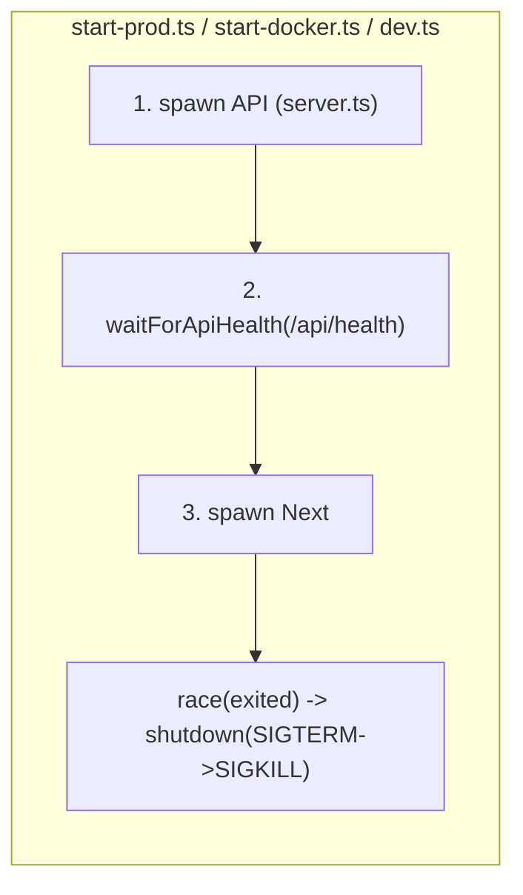
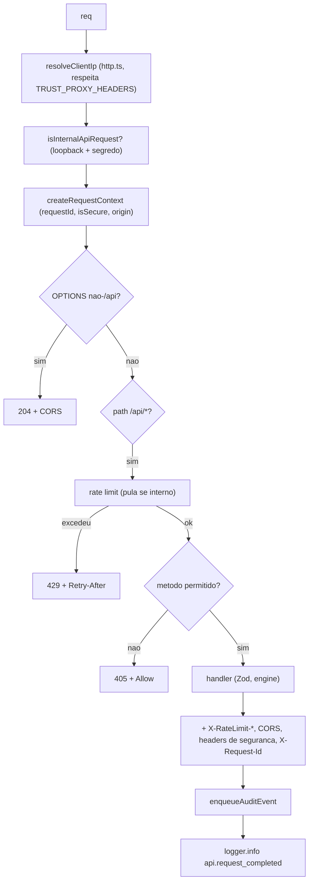

# 03 - Arquitetura de Runtime

## O que este capítulo ensina

Os processos que rodam, como sobem e descem, o ciclo de vida de uma requisição na API
Bun, e as fronteiras entre Next.js e Bun.

## Por que isso importa

Saber "o que está vivo na memória" é o que separa quem conserta um incidente em
minutos de quem fica horas perdido. Aqui você aprende as fronteiras e os pontos de
falha.

## Modelo mental

Dois motores ligados por um cano:

- Motor A: **Next.js** (porta 3000) — atende o navegador, renderiza páginas.
- Motor B: **Bun/`server.ts`** (porta 3201) — dados, estatística, segurança.
- O cano: o **rewrite** `/api/*` (`next.config.js`) e o helper `fetchApi`.

Um supervisor (script de start) liga os dois na ordem certa e os desliga juntos.

---

## Explicação detalhada

### Os processos e a supervisão

| Ambiente | Supervisor | Sobe |
| --- | --- | --- |
| Dev | `scripts/dev.ts` | API (3201) → espera health → Next dev (3000) |
| Produção local | `scripts/start-prod.ts` | copia `.next/static`, API → health → Next standalone |
| Docker | `scripts/start-docker.ts` | API → poll health (até `API_READY_TIMEOUT_MS`) → Next standalone |

Padrão comum nos três: **a API sobe primeiro** e o supervisor só inicia o Next depois
que `/api/health` responde (`waitForApiHealth`/`waitForApiReady`). Isso evita 502 em
rewrites durante o boot. Se qualquer filho morre, um `Promise.race` nas promessas
`.exited` dispara o `shutdown`.

Encerramento gracioso é centralizado em `lib/process-lifecycle.ts:stopSubprocess`:
envia `SIGTERM`, espera `graceMs`, e escala para `SIGKILL` se ainda vivo. Retorna
`'exited'` ou `'force-killed'`. Importante (documentado no `README`/`AGENTS.md`): em
Bun, `proc.killed` só indica que um sinal foi enviado — por isso o código **espera
`proc.exited`**, não confia em `killed`.



### Inicialização da API (`server.ts`) — ordem importa

1. **Antes das migrations**, valida o segredo de produção: se `NODE_ENV=production` e
   `IP_HASH_SECRET` ausente/curto, faz `process.exit(1)` (fail-closed), salvo o opt-in
   `IP_HASH_SECRET_AUTOGENERATE=true` (apenas para E2E). Isso impede mutar o banco num
   deploy mal configurado.
2. `runMigrations()` (`lib/db.ts`) aplica migrações pendentes em transação e verifica o
   schema (`verifyAuditSchema`, `verifyLogSchema` rejeitam `deleted_at`).
3. Inicia os escritores assíncronos: `startAuditWriter()`, schedulers de retenção de
   auditoria e de logs (intervalo de 24h; defaults 400 e 30 dias).
4. `serve({ port: PORT, fetch })` começa a aceitar conexões.

### Ciclo de vida de uma requisição na API

Tudo passa pelo `fetch(req, server)` de `server.ts`. A ordem (verificada):



Detalhes que pegam júniores:
- **Rate limit cobre tudo em `/api/*`, inclusive `/api/health`** (100 req/min por IP
  pseudonimizado; LRU de até 10.000 chaves). Chamadas internas (SSR→API com segredo +
  loopback) **pulam** o limite.
- **CORS é estrito**: sem wildcard; em produção só origens HTTPS de `ALLOWED_ORIGINS`.
- **Preflight `OPTIONS` em `/api/*` consome orçamento de rate limit** antes de
  responder 204 (decisão deliberada para não virar bypass).
- **Headers de segurança da API** (`buildApiSecurityHeaders`): CSP `default-src 'none'`,
  `nosniff`, frame deny, `Referrer-Policy: no-referrer`, e HSTS só se seguro+produção.
- **`405`** retorna header `Allow`; **`415`** para `Content-Type` não-JSON em rotas
  mutáveis; **`413`** para corpo acima de 10KB (`readJsonBodyWithLimit`).

### Fronteira Next.js ↔ Bun

- O navegador chama o Next (3000). Para dados, os **Server Components/Actions** chamam
  `fetchApi` (`lib/api/api-fetch.ts`), que resolve o host/porta da API
  (`API_HOST`/`API_PORT`, default `localhost:3201`) e, **se rodando no servidor e com
  `INTERNAL_API_SECRET` forte**, adiciona os headers `X-Megasena-Internal-Request*`.
- O navegador também pode bater em `/api/*` diretamente: o `next.config.js` reescreve
  para o Bun. O `proxy.ts` (middleware) **não** intercepta `/api/*` (excluído no
  matcher), então a CSP de páginas não vaza para a API.

### Edge vs servidor (logging)

Há dois registradores de sink de log: `lib/log-sink.server.ts` (com `import
'server-only'` e guarda `Bun` + `NEXT_RUNTIME !== 'edge'`) e `lib/log-sink.runtime.ts`
(sem guarda). O split evita que o sink baseado em SQLite seja carregado no runtime edge
do Next, que não tem `bun:sqlite`.

## Como verificar isso no código

```bash
# Supervisão e ordem de boot
grep -n "waitForApiHealth\|Promise.race\|stopSubprocess" scripts/dev.ts scripts/start-prod.ts
sed -n '1,60p' lib/process-lifecycle.ts

# Fail-closed do segredo e ordem de init
sed -n '350,416p' server.ts

# Ciclo de requisição
grep -n "checkRateLimit\|getCorsHeaders\|createMethodNotAllowedResponse\|withRequestIdHeader" server.ts
```

## Mal-entendidos comuns

- **"`/api/health` não tem rate limit."** Tem — está dentro de `/api/*`.
- **"`proc.killed` significa que o processo morreu."** Não em Bun; significa que um
  sinal foi enviado. Use `proc.exited`.
- **"O middleware aplica HSTS."** Não: `proxy.ts` força `isSecure=false`; HSTS fica no
  proxy reverso (nginx/Caddy/Cloudflare).
- **"O Next acessa o banco em produção."** Não; só o processo Bun.

## Exercícios

1. **(Fácil)** Em `server.ts`, encontre o valor de `RATE_LIMIT_MAX_REQUESTS` e a janela.
   **Gabarito:** 100 requisições / 60.000 ms.
2. **(Médio)** Explique por que o preflight `OPTIONS` para `/api/*` é tratado **depois**
   da checagem de rate limit. **Gabarito:** evitar que OPTIONS vire um caminho para
   contornar o limite.
3. **(Médio / debug)** A produção inicia mas `bun run deploy:verify` acusa versão
   antiga. Cite dois processos/passos a investigar. **Gabarito:** o build/`dist`
   enviado não foi atualizado; ou o container não reiniciou (Coolify não auto-deploy);
   `/api/health.version` reflete `package.json` da imagem em execução.
4. **(Difícil)** Por que validar `IP_HASH_SECRET` **antes** de `runMigrations()`?
   **Gabarito:** para não escrever no banco (migrations) num deploy mal configurado —
   fail-closed sem efeitos colaterais.

---

### Procedência das afirmações

- **Verificado no código:** supervisão e ordem de boot (`dev.ts`, `start-prod.ts`,
  `start-docker.ts`, `process-lifecycle.ts`); ciclo de requisição e headers (`server.ts`,
  `lib/security/http.ts`, `csp.ts`, `internal-api.ts`); split de sinks de log.
- **Inferido do código:** que esperar a saúde da API evita 502 (motivação clara do
  `waitForApiHealth`).
- **Conhecimento externo:** semântica de SIGTERM/SIGKILL e do runtime edge.
