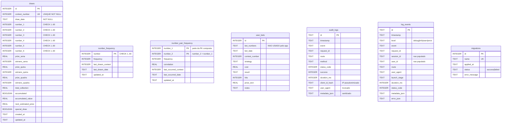

# 04 - Fluxo de Dados e Modelo de Dados (MER)

## O que este capítulo ensina

De onde os dados vêm, como são transformados, onde ficam guardados e como saem para a
tela. Inclui o **MER** (Modelo Entidade-Relacionamento) detalhado de todas as tabelas.

## Por que isso importa

Bugs de dados são os mais caros. Entender o caminho "CAIXA → SQLite → engines → API →
UI" e o formato exato de cada tabela evita corromper o banco ou confiar em campos que
não existem.

## Modelo mental

Pense num rio com três represas:

1. **Captação** — a API da CAIXA é a nascente; `pull-draws.ts` é a bomba.
2. **Reservatório** — o SQLite guarda a água tratada (sorteios validados).
3. **Distribuição** — os engines filtram/medem; a API entrega; a UI bebe.

A água nunca volta rio acima: a UI não escreve no banco. Só `pull-draws.ts` (e os
caches/auditoria internos) escrevem.

---

## Explicação detalhada

### Entrada: da CAIXA ao banco

1. `scripts/pull-draws.ts` chama `caixaClient.fetchAllDraws(...)`
   (`lib/api/caixa-client.ts`).
2. O cliente faz `GET https://servicebus2.caixa.gov.br/portaldeloterias/api/megasena/{n}`
   com **retry exponencial** (`fetchWithRetry`, até `API_CONFIG.MAX_RETRIES = 5`),
   **timeout** de 30s (`AbortController`), **ETag/304** (cache condicional) e
   **rate limiting progressivo** entre requisições.
3. A resposta crua (`CaixaRawDrawData`) é normalizada por `normalizeMegaSenaDrawData`
   (campos em português: `numero`, `dataApuracao`, `listaDezenas`, `rateioProcessamento`).
4. `pull-draws.ts` valida os 6 números com `normalizeMegaSenaNumbers`
   (`lib/analytics/draw-validation.ts`: exatamente 6, inteiros 1–60, únicos, ordenados)
   e insere em transação:
   - **Modo padrão:** `INSERT ... ON CONFLICT DO UPDATE` (atualiza existentes).
   - **`--incremental`:** `ON CONFLICT DO NOTHING` (só novos).
5. Ao final, recalcula o cache: `StatisticsEngine.updateNumberFrequencies()`.

Bordas e falhas (verificadas):
- Número de concurso é validado (inteiro, `1..10000`) antes do request.
- Em erro de uma faixa, sem `--allow-partial` a execução **aborta**; com a flag,
  registra `failedContests` e segue.
- Triggers de integridade (migração `007`) **rejeitam** no banco qualquer linha com
  números repetidos (`RAISE(ABORT, 'draw numbers must be unique')`).

### Transformação: os engines

Os engines (`lib/analytics/*`) leem o banco e produzem objetos tipados. A maioria
consulta a tabela `draws` diretamente; `StatisticsEngine`/`BetGenerator` usam o cache
`number_frequency`; `PairAnalysisEngine` usa o cache `number_pair_frequency`. Detalhes
por engine em `05-core-subsystems.md`.

### Saída: API e UI

- A API monta o JSON (ex.: `/api/statistics` agrega `summary`, `frequencies`,
  `patterns` e blocos opcionais por flag de query).
- Os Server Components (`app/dashboard/*`) chamam `fetchApi` (`lib/api/api-fetch.ts`),
  com `cache: 'no-store'` e timeout, e renderizam HTML.
- Cache de resiliência: `app/dashboard/page.tsx` e `statistics/page.tsx` guardam o
  último resultado em memória (TTL 5/10 min) como **fallback** se a API falhar.

### DTO de entrada (CAIXA) — formato real

```
CaixaRawDrawData {
  numero: number
  dataApuracao: string            // "DD/MM/AAAA"
  listaDezenas: string[]          // ["04","15",...]
  rateioProcessamento?: [{ descricaoFaixa, faixa, numeroDeGanhadores, valorPremio }]
  valorArrecadado?, valorAcumuladoConcurso?, valorAcumuladoProximoConcurso?,
  valorEstimadoProximoConcurso?, acumulado?, tipoJogo?
}
```

### MER detalhado



Observações importantes (verificadas):

- **Não há chaves estrangeiras entre as tabelas.** `number_frequency`,
  `number_pair_frequency` e `user_bets` referenciam `contest_number`/números por
  convenção, não por FK. São tabelas independentes; os caches são derivados de `draws`.
- **`draws` não armazena os 6 números como lista**, e sim em 6 colunas
  (`number_1..number_6`) com `CHECK(... BETWEEN 1 AND 60)`. Isso explica por que os
  engines fazem consultas por coluna.
- **`user_bets`** existe desde a migração `001` mas **nenhum código a lê ou escreve**
  (busca por `user_bets` fora de migrations retorna vazio). É estrutura reservada.
- **`audit_logs`/`log_events`** tinham `deleted_at` (migrações `004`/`005`), removido
  pela migração `006` ("no-soft-delete exception"). Hoje a retenção é **hard delete**.
- **`migrations`** é criada e estendida programaticamente em `lib/db.ts:runMigrations`
  (colunas `status`/`error_message` adicionadas via `ALTER TABLE`).

### Caches derivados

| Cache | Reconstruído por | Quando |
| --- | --- | --- |
| `number_frequency` | `StatisticsEngine.updateNumberFrequencies()` | após cada ingestão (`pull-draws.ts`) |
| `number_pair_frequency` | `PairAnalysisEngine.updatePairFrequencies()` | sob demanda, auto-popula se vazio em `getNumberPairs()` |

### Tabelas de auditoria/log: como os dados entram

- A API enfileira eventos: `enqueueAuditEvent` (`lib/audit.ts`) e o logger →
  `enqueueLogEvent` (`lib/log-store.ts`). Ambos usam fila assíncrona com flush em lote
  (intervalo 2s, limites de tamanho) e transação `BEGIN IMMEDIATE`.
- IP nunca é gravado cru: vira `client_id_hash` via `pseudonymizeIp` (HMAC-SHA256).

## Como verificar isso no código

```bash
# Schema real (fonte do MER)
sed -n '1,80p' db/migrations/001_initial_schema.sql
cat db/migrations/006_remove_deleted_at.sql
cat db/migrations/007_draw_number_integrity.sql

# Ingestão e validação
grep -n "ON CONFLICT\|allow-partial\|updateNumberFrequencies" scripts/pull-draws.ts
grep -n "normalizeMegaSenaNumbers" lib/analytics/draw-validation.ts

# Caches derivados
grep -n "DELETE FROM number_pair_frequency\|INSERT INTO number_pair_frequency" lib/analytics/pair-analysis.ts
```

## Mal-entendidos comuns

- **"Os números ficam num array no banco."** Não: 6 colunas separadas. Consultas e
  o `InMemoryDatabase` de teste dependem disso.
- **"`number_frequency` é a fonte de verdade."** É um **cache derivado** de `draws`;
  se você inserir sorteios sem rodar `updateNumberFrequencies`, ele fica desatualizado.
- **"A UI grava apostas no banco."** Não. O gerador devolve apostas na resposta; nada
  é persistido em `user_bets`.
- **"`deleted_at` ainda existe."** Os comentários das migrações `004`/`005` mencionam
  soft delete, mas a `006` removeu a coluna; confie no schema final.

## Exercícios

1. **(Fácil)** Conte quantas tabelas o banco tem após todas as migrações e diga quais
   são caches. **Gabarito:** `draws`, `number_frequency`*, `number_pair_frequency`*,
   `user_bets`, `audit_logs`, `log_events`, `migrations` (*=cache).
2. **(Médio / rastreamento)** Siga um sorteio novo da CAIXA até a tela do dashboard.
   Quais funções o transformam? **Gabarito:** `fetchDraw` → `normalizeMegaSenaDrawData`
   → `normalizeMegaSenaNumbers` → `INSERT` → `updateNumberFrequencies` → `/api/dashboard`
   (`StatisticsEngine.getDrawStatistics` + `getDrawHistory`) → `app/dashboard/page.tsx`.
3. **(Médio / debug)** Suponha que o dashboard mostra frequências erradas após uma
   importação. Qual passo provavelmente foi pulado? **Gabarito:**
   `updateNumberFrequencies()` (cache não recalculado).
4. **(Difícil)** Por que a trigger de unicidade (migração 007) é necessária se
   `draw-validation.ts` já valida unicidade em JS? **Gabarito:** defesa em profundidade
   — qualquer caminho de escrita (inclusive scripts ad-hoc como `fetch-missing.ts`)
   passa pela trigger; a validação JS não cobre todos os inserts.

---

### Procedência das afirmações

- **Verificado no código:** schema completo (migrações `001`–`007`); ingestão e flags
  (`pull-draws.ts`); normalização (`caixa-client.ts`, `draw-validation.ts`); caches
  (`statistics.ts`, `pair-analysis.ts`); pseudonimização do IP; ausência de FKs e de
  uso de `user_bets`.
- **Inferido do código:** que `user_bets` é "reservado para o futuro" (presente no
  schema, sem uso) — interpretação mais sustentada pela ausência de qualquer query.
- **Conhecimento externo:** formato dos campos da CAIXA em português.
